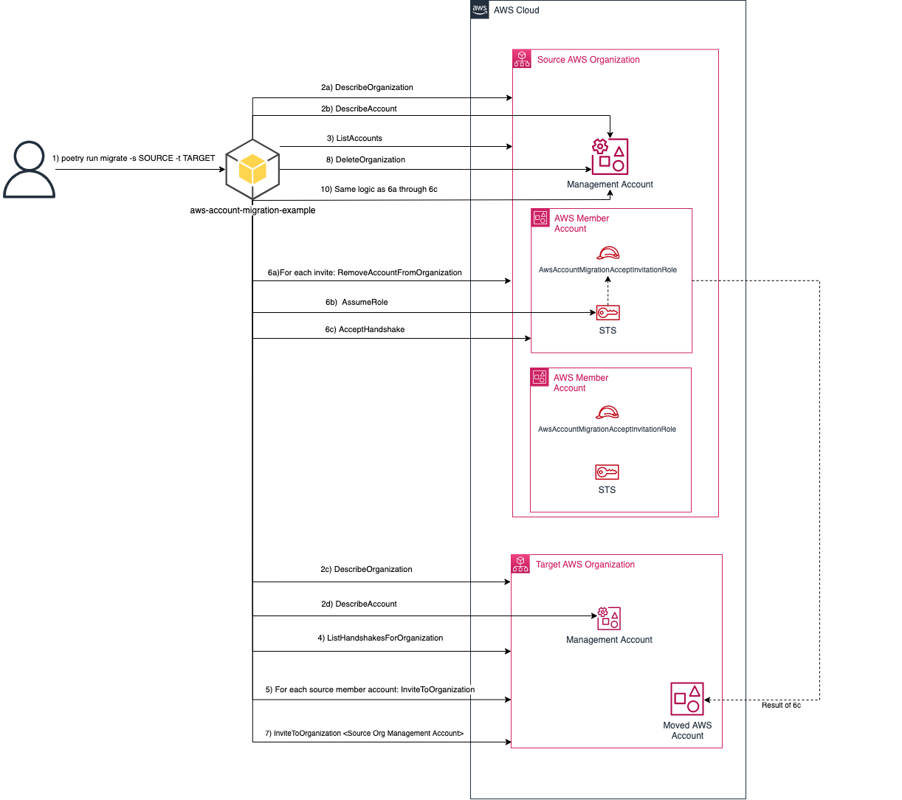

# aws-account-migration-example

## Overview

This project provides **example** code of how customers can automate the migration of AWS accounts from one AWS organization to another. 

Before performing any such migration you should read _all_ the considerations mentioned in this [knowledge center](https://aws.amazon.com/premiumsupport/knowledge-center/organizations-move-accounts/) 
article. The script does not handle updating the account payment method, updating the account support plans, nor phone verification. 
These prerequisite steps will need to be handled manually or with help from AWS Support. 

It is **strongly** recommended that you reach out to AWS support or your AWS account team to discuss any risks associated with migrating accounts between organizations.


## Prerequisites

In additions to the considerations and caution mentioned in the [overview](#Overview) the follow prerequisite steps must be taken

1. Python 3.10 or later
1. Install [Poetry](https://python-poetry.org/docs/) on your local machine
1. On your local machine you _must_ have an [AWS credentials file](https://docs.aws.amazon.com/cli/latest/userguide/cli-configure-files.html) 
that contains [named profiles](https://docs.aws.amazon.com/cli/latest/userguide/cli-configure-profiles.html) for the source AWS organization management account
and the target AWS organization management account. These named profiles need to be for roles that have Administrator level access.
1. You must deploy the [accept-invitation-role.yml](./accept-invitation-role.yml) CloudFormation template to all the accounts in the source AWS organization being migrated. 
   1. If you are migrating a large number of accounts you can deploy the template as a [StackSet](https://docs.aws.amazon.com/AWSCloudFormation/latest/UserGuide/stacksets-concepts.html) from the source AWS organization management account.

## Execution

* First install all the python dependencies using poetry
```
> poetry install
```
* Run the script to see the arguments
```
> poetry run migrate --help

usage: Aws Account Migration Example [-h] -s SOURCE -t TARGET [-a ACCOUNT] [-q]

Example script from migrating all accounts from one AWS Organization to another

options:
  -h, --help            show this help message and exit
  -s SOURCE, --source-organization-profile SOURCE
                        This is the profile name that has Admin access to the management account of the SOURCE AWS organization that accounts will be migrated out of to the target
  -t TARGET, --target-organization-profile TARGET
                        This is the profile name that has Admin access to the management account of the TARGET AWS organization that source accounts will be migrated to
  -a ACCOUNT, --account ACCOUNT
                        Migrate a specific account from the SOURCE AWS organization to the TARGET AWS organization
  --ou ORGANIZATIONAL_UNIT
                        The destination OU in the TARGET AWS organization, if not specified account will land in the root of the TARGET Aws organization
  -q, --quiet           Do not prompt for confirmation

--help for more info
```
* To migrate a single account run the following command
```
> poetry run migrate -s <SOURCE_ORGANIZATION_PROFILE_NAME> -t <TARGET_ORGANIZATION_PROFILE_NAME> -a <ACCOUNT_NUMBER_TO_MIGRATE> --ou <DESTINATION_ORGANIZATIONAL_UNIT_ID>
```
* To migrate all accounts from the source organization to the target organization run the following command. 
```
> poetry run migrate -s <SOURCE_ORGANIZATION_PROFILE_NAME> -t <TARGET_ORGANIZATION_PROFILE_NAME> --ou <DESTINATION_ORGANIZATIONAL_UNIT_ID>
```
**NOTE**: This operation will also migrate the source organization's management account which includes deletion of the source organization


## Architecture

